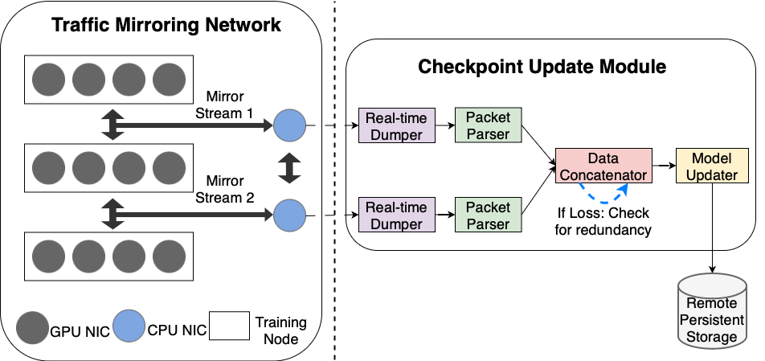

## FlowCheck: Decoupling Checkpointing and Training For Large-Scale Models

Code for paper "FlowCheck: Decoupling Checkpointing and Training For Large-Scale Models".




### Running Environment

- To run the code, you first need to connect the CPU checkpoint nodes as required by the paper, and configure the mirroring function of the switch.
    
    - In H3C switches, the configuration instructions are:
    ```
    system-view
    mirroring-group 1 local
    mirroring-group 1 mirroring-port XXX inbound/outbound
    mirroring-group 1 monitor-port YYY
    ```
- The minimum memory requirement for CPU checkpoint nodes varies with the scale of the workload, but we recommend that the checkpoint node memory should be no less than 300GB.

- The code for this project utilizes Intel I/OAT functionality, so please ensure that the CPU on the checkpoint node supports this feature.

- This project utilizes DPDK for packet dumping, so please ensure that [DPDK](https://github.com/DPDK/dpdk) is properly installed and the RDMA NICs in use are bound before running it. The DPDK version used in this project is 23.11.

- If you use CX6 NICs, you need to disable RoCE:
```
mlxconfig -d 82:00.0 s ROCE_CONTROL=1
``` 


### Build

Prior to executing the code, please ascertain that all module functionalities have been compiled.

Compiler versions used in the project: gcc 11.2.0, clang 10.0.0.


Build all modules in one line:

```
sh build.sh
```

Besides, you need to bind DPDK with DMA engines:
```
echo 1 > /sys/module/vfio/parameters/enable_unsafe_noiommu_mode
```


### Running instructions


1. Start the Real-Time Dump Module.

Here we show the example of starting the dump module of two mirror streams:

```
./Packet_Dump/dma_dump/build/dmafwd -l 40-41 -n 1 -a 0000:ca:00.0 -a 0000:80:01.0 -a 0000:80:01.1 -a 0000:80:01.2 -a 0000:80:01.3 -a 0000:80:01.4 -a 0000:80:01.5 -a 0000:80:01.6 -a 0000:80:01.7 --huge-unlink --file-prefix pg1 -- -p 0x1 -c hw -q 8
./Packet_Dump/dma_dump/build/dmafwd -l 22-23 -n 1 -a 0000:6b:00.0 -a 0000:00:01.0 -a 0000:00:01.1 -a 0000:00:01.2 -a 0000:00:01.3 -a 0000:00:01.4 -a 0000:00:01.5 -a 0000:00:01.6 -a 0000:00:01.7 --huge-unlink --file-prefix pg2 -- -p 0x1 -c hw -q 8
```

You can customize these parameters according to your own environment:
- `-l`: the bind CPU core IDs.
- `-a`: the PCIE address of the NIC.
- `-q`: the number of used DMA engines.

2. Start the Packet Parser Module.

```
./Packet_Parser/cpp_decode_inbound/build/unpack_app
./Packet_Parser/cpp_decode_outbound/build/unpack_app
```

3. Start the Data Extractor Module.

```
./Data_Extractor/build/extract_app
```

4. Start the Updater Module.

```
./Cython_Updater/build/app
```

5. Start the workload on training nodes.

In the directory `./Workload_Gen`, we showcase a minimal example of launching GPT model training.

Make sure that the all-reduce traffic is properly mirrored by the switches and transmitted to the CPU checkpoint node.